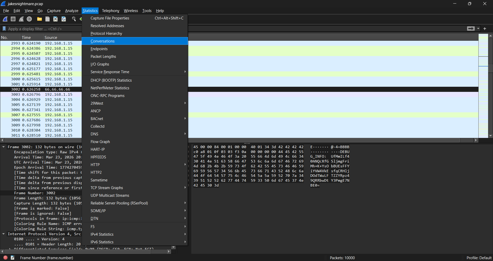
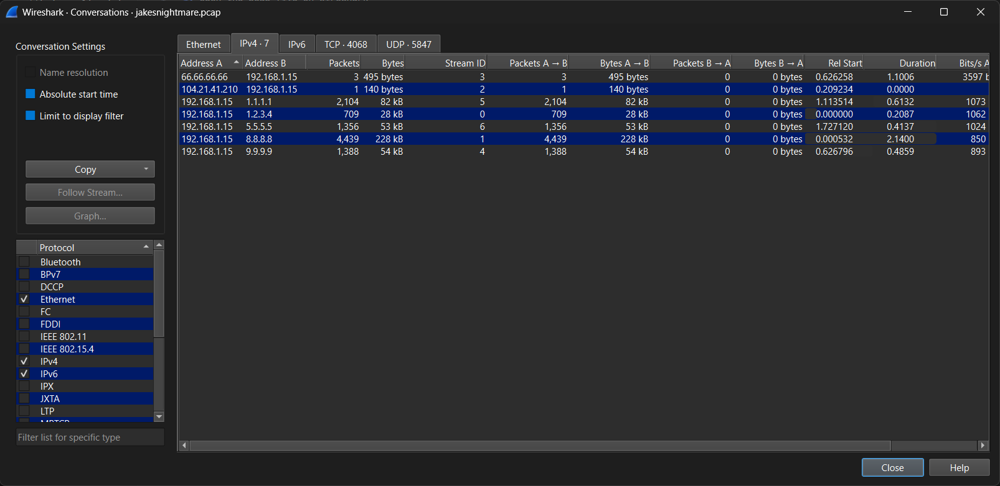
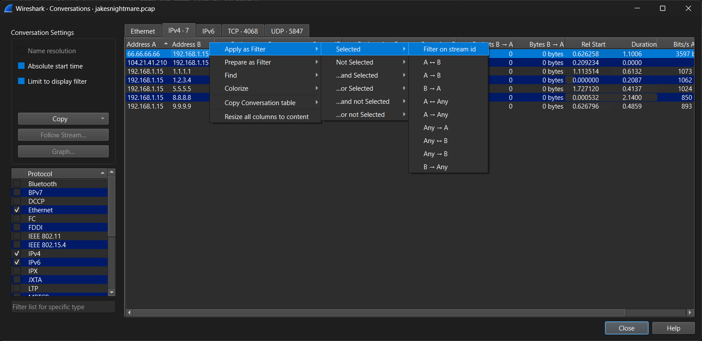
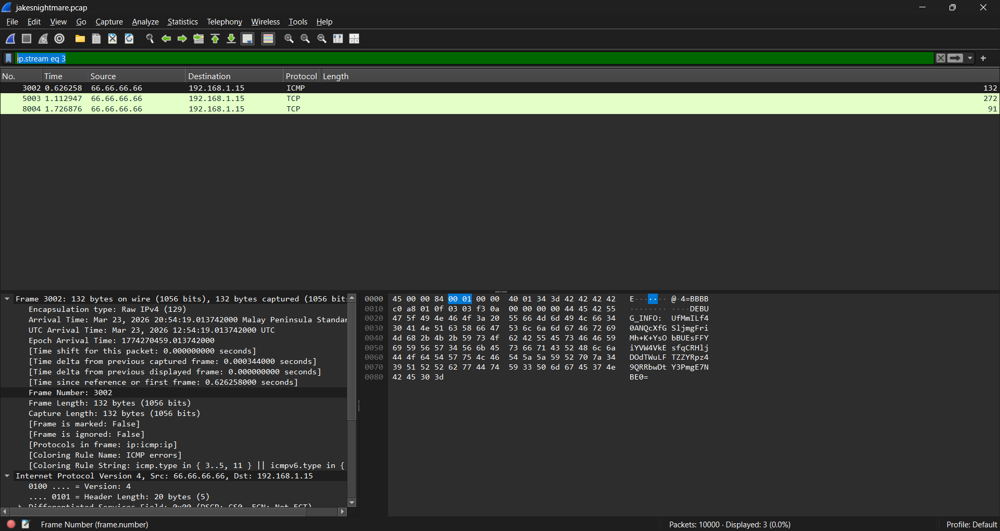
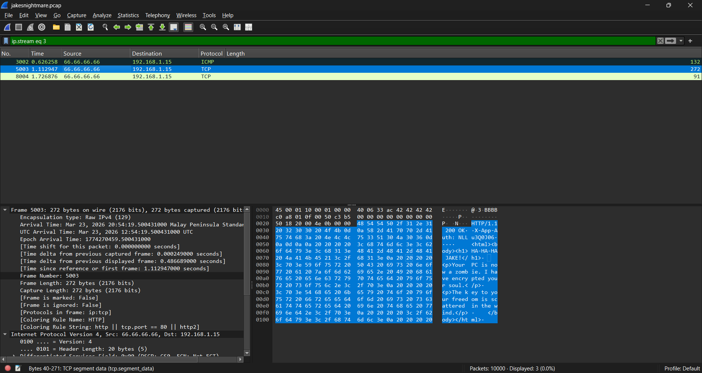

1. open the pcap file on wireshark
2. go to Statistics > Conversations > IPv4 tab.

- look at the first item 'Address A' it has `66.66.66.66` which is illuminati idk

3. right click the item > Apply as Filter > Selected > Filter on stream id

4. close the window. note: the search thingy inow has `ip.stream eq 3` on it. <br>which could have saved u some time if u just put it there but oh welp.

5. going to each list item heres what i found<br>u can copy it by right clicking the text and selecting `...as ASCII Text`

- item 1
```
E@4=BBBB
DEBUG_INFO: UfMmILf40ANQcXfGSljmgFriMh+K+YsObBUEsFFYiYVW4VkEsfqCRHljDOdTWuLFTZZYRpz49QRRbwDtY3PmgE7NBE0=
```
- item 2
```
E@3BBBBPP NHTTP/1.1 200 OK
X-App-Auth: NLLu3Q0J06


    <html><body><h1>HA-HA-HA JAKE!</h1>
    <p>Your PC is now a zombie. I have encrypted your soul.</p>
    <p>The key to your freedom is scattered in the wind.</p>
    </body></html>
    
```
- item 3
```
E[@4aBBBBPP dUHTTP/1.1 404 Not Found
Server-Token: BBx6w9Q==
```
7. typing `ip.stream eq 2` on the search thingy only show 1 item.
```
E@&h)PP <!HTTP/1.1 200 OK
X-Session-ID: AKdgd
Content-Type: application/octet-stream

[DJ_APP_BINARY_DATA]
```
8. maybe it result into this idk. 
```
UfMmILf40ANQcXfGSljmgFriMh+K+YsObBUEsFFYiYVW4VkEsfqCRHljDOdTWuLFTZZYRpz49QRRbwDtY3PmgE7NBE0=

AKdgdNLLu3Q0J06BBx6w9Q==
```
